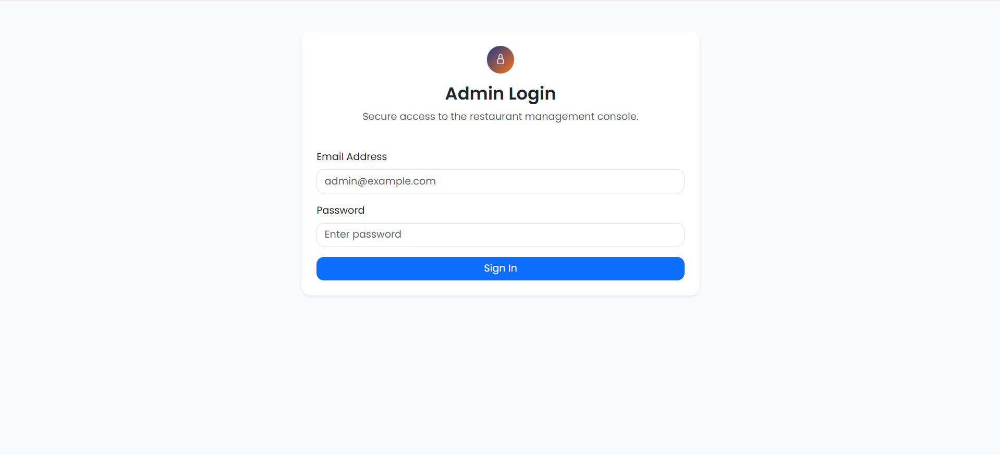
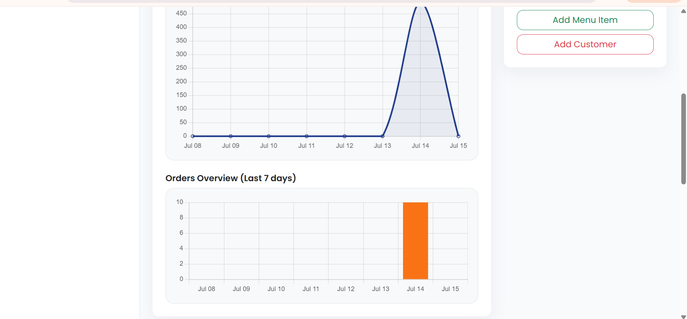
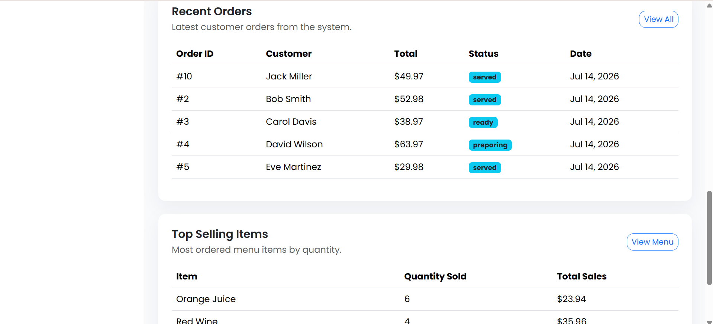
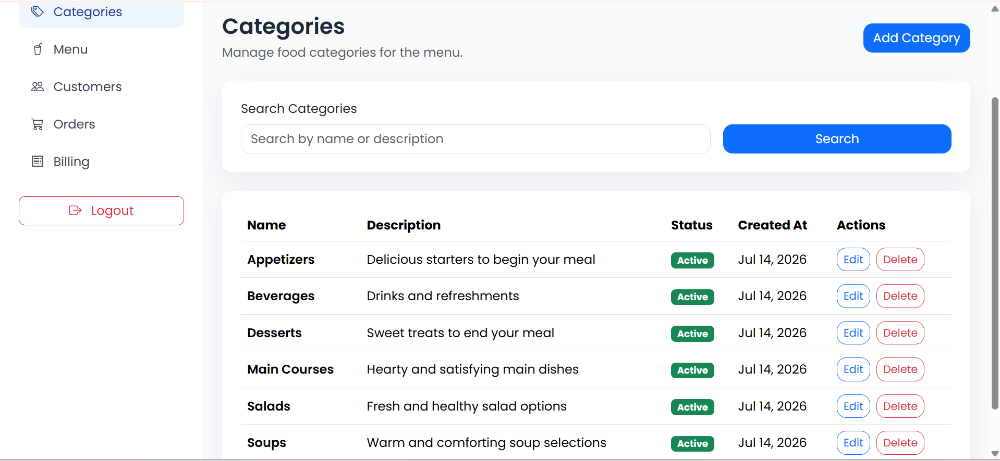
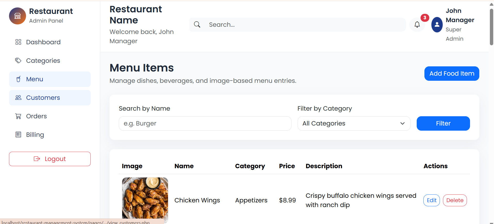
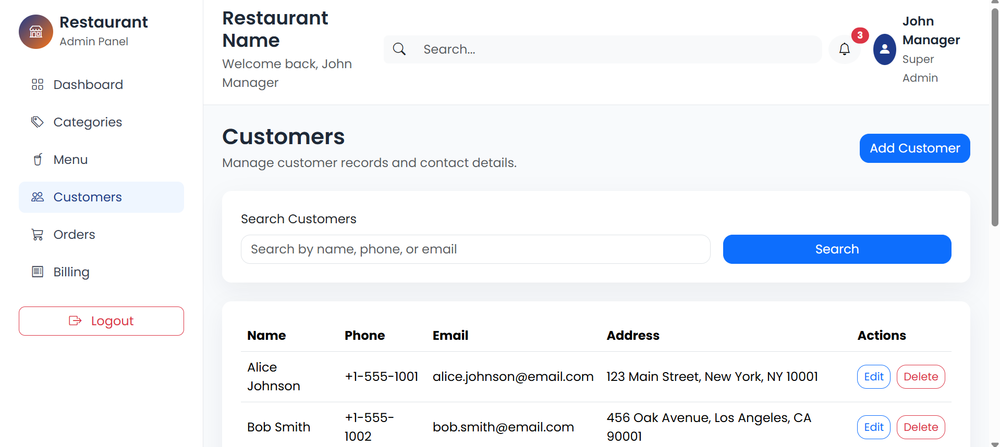
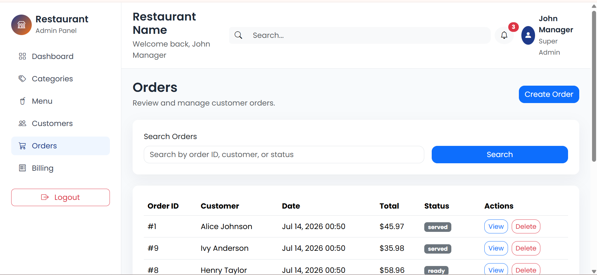
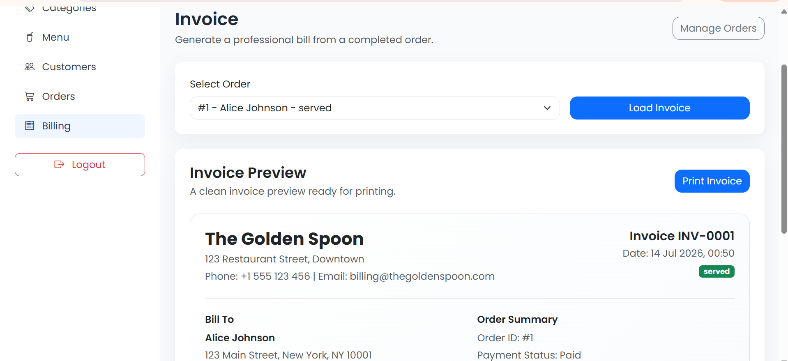
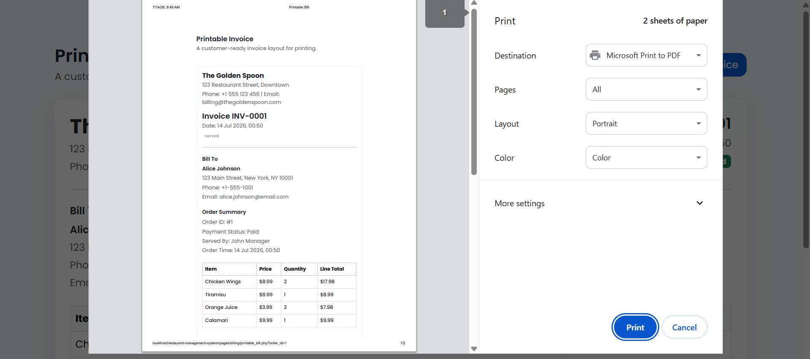

# 🍽️ Restaurant Management System

A full-stack **Restaurant Management System** built using **PHP, MySQL, HTML, CSS, JavaScript, and Bootstrap 5**. The application enables restaurant staff to efficiently manage menu items, customers, orders, billing, and invoices through a secure and responsive web interface.

---

## 📌 Features

- 🔐 Secure User Authentication
- 📊 Interactive Dashboard
- 🍔 Menu Management (Add, Edit, Delete, View)
- 👥 Customer Management
- 🛒 Order Management
- 🧾 Automatic Invoice Generation
- 📈 Sales & Revenue Overview
- 📱 Responsive Design
- 🛡️ SQL Injection Protection using Prepared Statements
- 🔒 CSRF Protection
- ✅ Input Validation & Error Handling

---

## 🛠️ Tech Stack

### Frontend
- HTML5
- CSS3
- Bootstrap 5
- JavaScript

### Backend
- PHP 8

### Database
- MySQL

### Development Tools
- XAMPP
- phpMyAdmin
- VS Code
- Git & GitHub

---

## 📂 Project Structure

```
restaurant-management-system/
│
├── assets/             # CSS, JavaScript, Images
├── config/             # Database configuration
├── database/           # SQL schema and sample data
├── docs/               # Project documentation
├── includes/           # Reusable PHP components
├── uploads/            # Uploaded files
├── index.php           # Application entry point
├── README.md
└── LICENSE
```

---

## 🗄️ Database Overview

The application uses a relational MySQL database consisting of tables such as:

- Users
- Customers
- Categories
- Menu Items
- Orders
- Order Details
- Invoices

The database is designed with proper relationships to ensure data consistency and efficient querying.

---

## 📸 Screenshots

### Login Page



### Dashboard






### Categories



### Menu Management



### Customer Management



### Order Management



### Invoice




> **Note:** Create a folder named `screenshots` in the project root and add your images with the filenames shown above.

---

## 🚀 Installation

### 1. Clone the Repository

```bash
git clone https://github.com/ShravaniJ77/restaurant-management-system.git
```

### 2. Move the project to XAMPP

Copy the project folder into:

```
xampp/htdocs/
```

### 3. Import the Database

- Open **phpMyAdmin**
- Create a new database
- Import the SQL file from the `database` folder

### 4. Configure Database Connection

Update the database credentials in the configuration file if required.

### 5. Run the Project

Start **Apache** and **MySQL** from XAMPP.

Open:

```
http://localhost/restaurant-management-system
```

---

## 🔒 Security Features

- Password Hashing
- Session Management
- Prepared Statements
- SQL Injection Prevention
- CSRF Protection
- Input Validation
- XSS Prevention

---

## 🎯 Future Enhancements

- Online Payment Gateway
- QR Code Menu
- Inventory Management
- Table Reservation
- Email Notifications
- Customer Feedback System
- Sales Reports & Analytics
- Role-Based Access Control

---

## 📚 Learning Outcomes

This project helped in gaining practical experience with:

- Full-Stack Web Development
- PHP & MySQL Integration
- Database Design
- CRUD Operations
- Authentication & Authorization
- Secure Coding Practices
- Responsive UI Development
- Version Control using Git & GitHub

---

## 👩‍💻 Author

**Shravani Jagadeesh**

Computer Science Engineering Student

GitHub: https://github.com/ShravaniJ77

---

## ⭐ Support

If you found this project useful, consider giving it a ⭐ on GitHub.